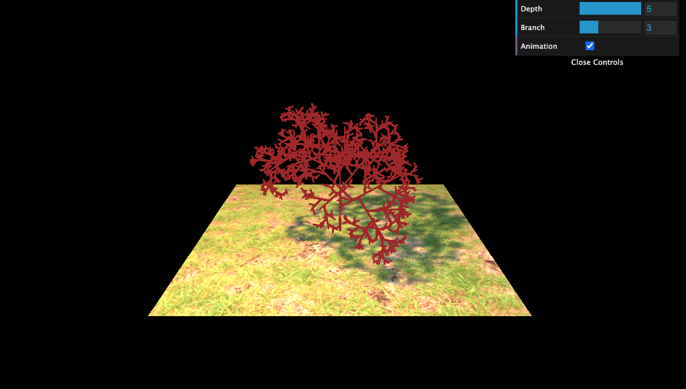

# 3DTree

This program generates a 3D fractal-like tree. Please check here https://fractaltree3d.web.app/

<h3>Installation</h3>

a) `npm install`  
b) `npm run dev`  
c) It will be locally available at: http://localhost:5173/  

<h3>Features</h3>
1. Uses 3D cylinder  
2. The children branches are at 60-degree angle from their parent  
3. Branches are scattered around the parent in 3D  
4. Number of branches, recursion depth, and animation can be configured  
5. Branches rotate around the axis  
6. Texture and Shadow on the plane  

<h3>Sample</h3>

